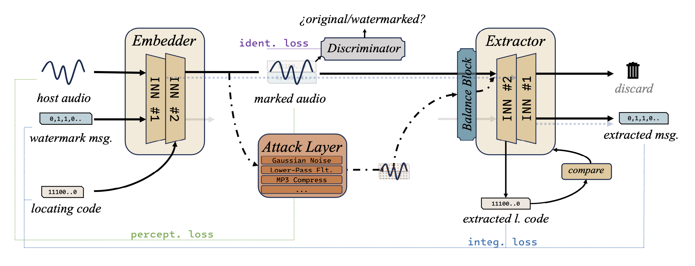
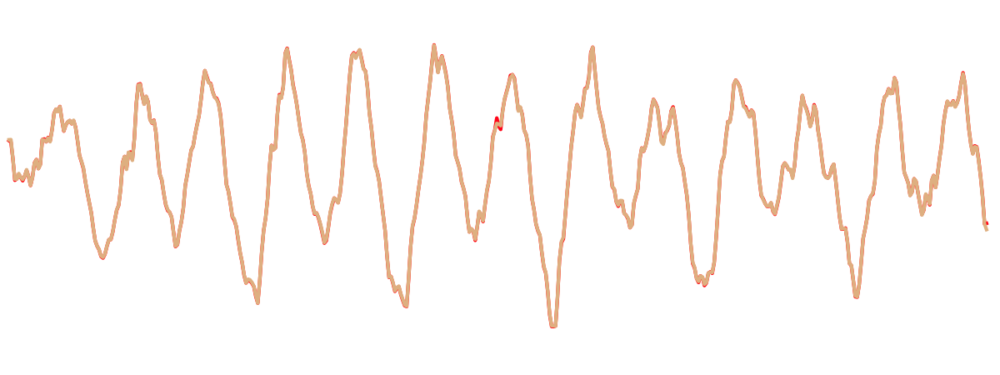
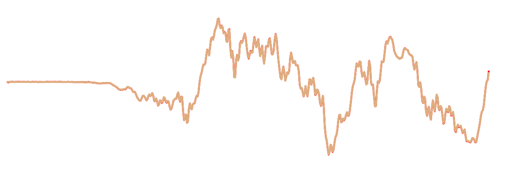
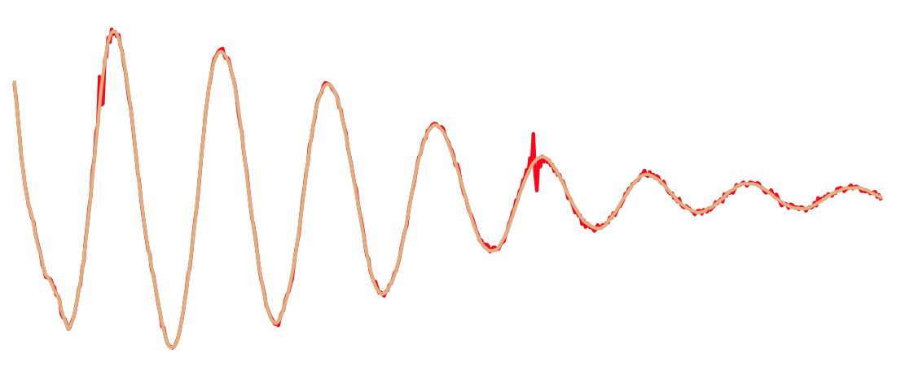
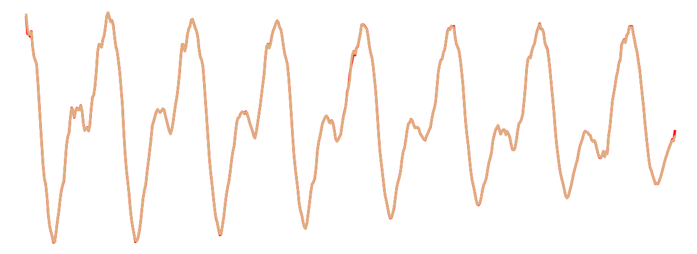
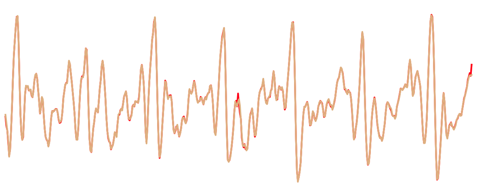

# IDEAW

## Abstract

Audio watermarking embeds messages into audio and accurately extracts the watermark even after the watermarked audio has been damaged. Compared to traditional digital watermarking algorithms, neural watermarking using neural networks has better robustness for various attacks are considered during training. However, neural watermarking methods suffer to low capacity and undesirable imperceptibility. In addition, in practical scenarios, watermarks are redundantly embedded in audio according to the demand, and the audio is also subjected to cropping and splicing, which makes the efficient locating of watermarks a problem worth exploring. In this paper, we design an invertible neural network to realize a dual-embedding watermarking model for efficient locating, at the same time, we consider the impact of the attack layer on the invertible neural network in robustness training and improve the model so as to enhance the reasonableness and stability. Experiment shows that the proposed model, **IDEAW**, can withstand various attacks and has higher capacity with more efficient locating ability compared to the state-of-the-art methods.

## Overview

The Architecture of IDEAW.

&nbsp;
 

## Watermarked Audio&Waveform Samples
Audio samples are taken from the VCTK corpus and FMA corpus. The capacity of **IDEAW** achieves 46 bits per second (maintaining SNR at above 30 dB).
The red and dark yellow waveform in the figures stand for watermarked audio and host audio respectively (500-point details of watermarked audio segments).

Audio samples are randomly selected from FMA dataset (musica) and VCTK dataset (speech).

### What can 46-bit watermark message accomplish?

&nbsp;
 

#### · Embedding 7*6 binary figures into audios.
##### I

 <audio controls id="player" onplay="pauseOthers(this);"><source src="assets/wmd_audios/070.mp3" type="audio/mpeg"></audio> embedded 5 times, SNR=35.14, ACC=1(280/280)

&nbsp;
 

##### D

<audio controls id="player" onplay="pauseOthers(this);"><source src="assets/wmd_audios/554.mp3" type="audio/mpeg"></audio> embedded 5 times, SNR=36.29, ACC=0.9928(278/280)

&nbsp;
 

##### E

<audio controls id="player" onplay="pauseOthers(this);"><source src="assets/wmd_audios/012.mp3" type="audio/mpeg"></audio> embedded 5 times, SNR=35.87, ACC=0.9964(279/280)

&nbsp;
 

##### A

<audio controls id="player" onplay="pauseOthers(this);"><source src="assets/wmd_audios/022.mp3" type="audio/mpeg"></audio> embedded 5 times, SNR=33.12, ACC=1(280/280)

&nbsp;
 

##### W

<audio controls id="player" onplay="pauseOthers(this);"><source src="assets/wmd_audios/024.mp3" type="audio/mpeg"></audio> embedded 5 times, SNR=32.43, ACC=0.9928(278/280)

&nbsp;
 

&nbsp;
 

#### · Embedding characters which are encoded to 5-bit codes into audios. (46 bits watermark -> 9 characters)
Embedding "IDEAWOKAY" (01000-00100-00101-00001-10111-01111-01011-00001-11001-0) into audio.

##### "IDEAWOKAY"

<audio controls id="player" onplay="pauseOthers(this);"><source src="assets/wmd_audios/331.mp3" type="audio/mpeg"></audio> embedded 5 times, SNR=34.54, ACC=0.9964(279/280)

&nbsp;

&nbsp;
 

# IDEAW Code
We will release our code as soon as the paper is accepted. 🍹
